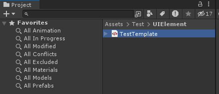
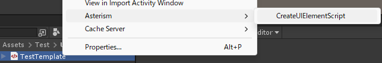
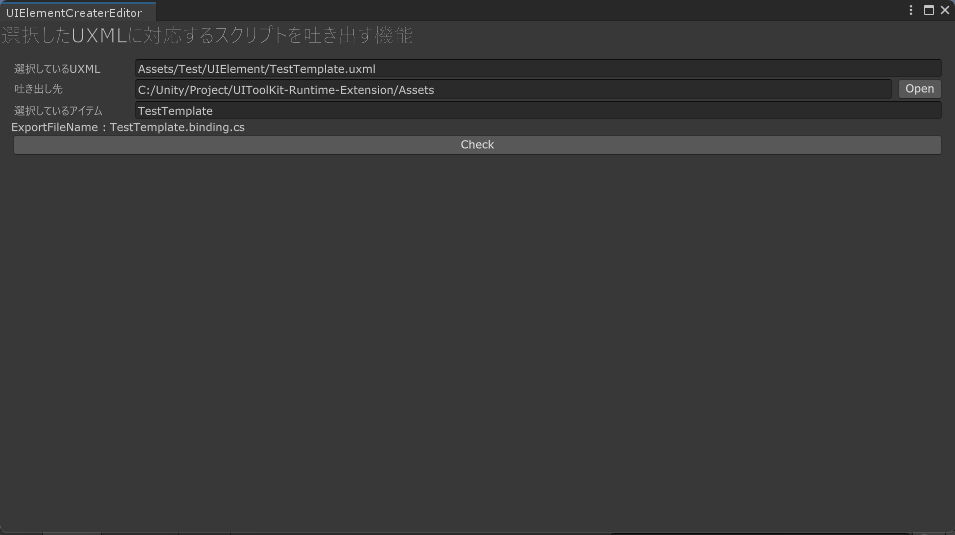
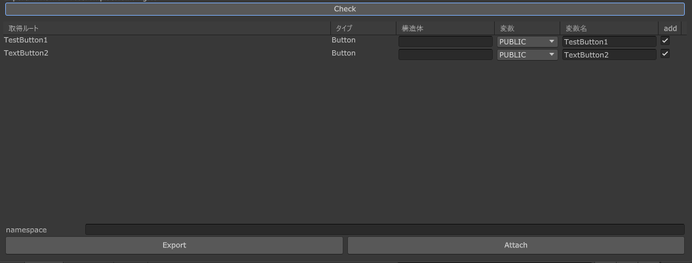
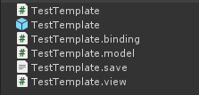

# Bindingファイル関連自動生成ツールの使い方

- 今回サンプルとして、TestTemplate.uxmlを指定してます

## ツール画面の表示まで
1. bindingファイルを生成したいUXMLファイルをProjectWindow上で選択する

1. 選択したUXMLファイル上で右クリックを行い、Asterism > CreateUIElementScript を選択する

1. すると以下のようなウィンドウが表示される

## 画面説明

|項目|説明|
|---|---|
|選択しているUXML|このウィンドウを出した際に指定したUXMLファイルのプロジェクト内でのパスが表示されます|
|吐き出し先|対応するbindingファイル等を吐き出す先の指定が可能。Openを押すことでフォルダ選択ダイアログを表示します|
|選択しているアイテム|選択しているファイルを吐き出す際に指定するクラス名などの設定となります（基本はUXMLと名称が一緒なものが吐き出される想定）|
|Check|ボタンを押下することで、UXMLの設定を確認してどのような出力になるか確認・設定が可能となります|

### Checkボタンを押下した後
以下の画像のような内容が表示されるようになります

|項目|説明|
|---|---|
|取得ルート|このVisualElementを取得可能となるまでのルートが表示されます。表示されるルートについては、UIToolkitのツール上でUIを作成した際に名称を設定した（＃～～～という表示）もので構成されます|
|タイプ|取得したVisualElementがどのタイプかが表示されます。|
|構造体|複数の項目を１つのクラスとしたいときなどに利用します。ここに指定された文字列で、同一な物同士で１つのまとまりとします|
|変数|作成する変数をどの形とするか指定が可能です。どのようなものがあるかは変数定義項目を確認してください|
|変数名|変数名を指定することが可能です。デフォルトは取得したVisualElementに指定されている名前が設定されています。名前をつける際には、予約後に気をつけてつけるようにしてください。|
|add|項目をBIndingとして追加するかどうかの設定が可能|
|namespace|吐き出された.binding.csファイルのクラスに対して、namespaceの設定が可能です。|
|Export|吐き出しを行います。既にファイルがある場合、.binding.csファイルのみ上書きされます。|
|Attach|吐き出し済みの場合のみ利用が可能です。自動で吐き出したUI用のプレハブに作成したクラスをアタッチします|

#### 変数定義
|定義|内容|
|---|---|
|PUBLIC|public 変数名 と出力されます|
|PRIVATE|private 変数名 と出力されます|
|PROTECTED|protected 変数名 と出力されます|
|PRIVATE_SerializeField|[SerializeField] private 変数名 と出力されます|
|PROTECTED_SerializeField|[SerializeField] protected 変数名 と出力されます|
|PUBLIC_READONLY|public readonly 変数名 と出力されます|
|PRIVATE_READONLY|private readonly 変数名 と出力されます|
|PROTECTED_READONLY|protected readonly 変数名 と出力されます|

## 吐き出されたファイルについて
Exportボタンを押下後、処理が完了すると以下のような状態になります。  
ファイル構成は、MVCモデルに近い形でファイルに処理が記載が可能なように分けています。  

|ファイルタイプ|用途|
|---|---|
|ClassName.cs|基本的な処理を記載する。bindingされているVisualElementに対して各種設定を行うなど|
|ClassName.prefab|UIDocumentに設定済みの状態のプレハブ。このClassNameのスクリプトがアタッチされている想定|
|ClassName.binding.cs|UIDocumentから取得したVisualElementから、必要な項目を各バインドしていく|
|ClassName.model.cs|通信関連などの処理を記載する|
|ClassName.save.txt|bindingファイルを生成したときの設定が記載されている。このファイルがある場合は、このファイル上でこのツールを起動することが可能で、設定内容を引き継いで修正が可能|
|ClassName.view.cs|UIの表示に関わる対応を行っていく|

